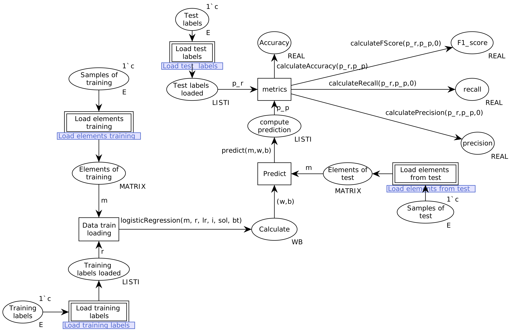
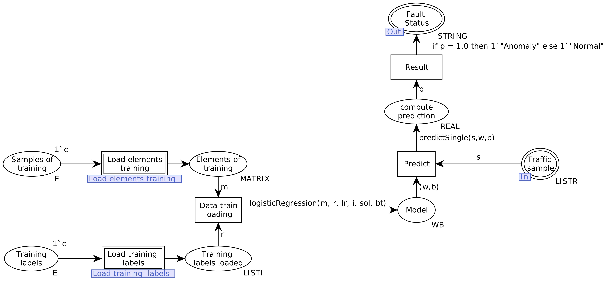

# LRHCPN
Implementation of the logistic regression algorithm in colored Petri nets

<p align="justify">
Implementation of the logistic regression algorithm for colored Petri nets using the CPN-tools software. The algorithm works for classification. It includes various functions implemented in CPN-ML and examples of applications in different databases. An excellent tool for those working with CPN-tools and discrete event systems.
</p>

**:rocket: Technologies used in the project:**

:computer: CPN Tools:  https://cpntools.org/
:memo: Version: 4.0.1

# ⚙️ **Implementation Features** 

- **Applicable to binary Classification:** <p align="justify">The LR algorithm implemented in coloured Petri nets (LRHCPN) is suitable for addressing both binary classification problems.</p>

- **Graphical Visualization:** <p align="justify"> The model in Petri nets provides a graphical visualization of the LR algorithm, making the modeling process straightforward and user-friendly.</p>

- **Fully Adaptable Implementation:** <p align="justify"> The proposed method offers a fully adaptable implementation and can be used with any set of numerical data for binary classification.</p>

- **Versatile Application:** <p align="justify"> This implementation is ideal for modeling discrete systems, supporting the development of a variety of new applications.</p>

# :exclamation: **Instructions for using RL for binary classification:** 
- **`STEP 1:`**<p align="justify"> Open the CPN tools and in the toolbox open the **NET** palette, then click on the **Load net** option and load the `RL_IOT.cpn` model.</p>
- **`STEP 2:`**<p align="justify"> In the CPN Tools toolbox, with the model loaded, click on the `Declarations` option. Upon clicking this item, directly below `Standard declarations`, you will find the `Config model` option to adjust the model parameters. The configurable parameters are: `i` (number of iterations), `bt` (batch size setting, used only with the "mini-batch" solver; use `NONE` for other configurations), `lr` (learning rate), and `solver` (optimizer). For `solver`, there are currently three available functions: `"sgd"`, `"batch"`, and `"mini-batch"`.</p>
- **`STEP 3:`**<p align="justify"> In the transitions `Load elements from test`, `Load elements training`, `Load test labels`, and `Load training labels`, adjust the links to the location on your computer where the .txt files of the training and testing databases are stored. The databases are divided into four parts: training samples, testing samples, training labels, and testing labels. Place the files in the correct locations.</p>
- **`STEP 4:`**<p align="justify"> For a faster simulation, in the toolbox, open the `Simulation` palette and press the `Fast forward` tool. You can also adjust the value of this tool to simulate a larger number of model steps.
</p>

# :bulb: **Simulation of discrete event systems** 


<p align="justify">
The LRHCPN opens up new possibilities for the modeling of discrete event systems, and it can be integrated into other models to perform binary classification tasks.
</p>



<p align="justify">
In the detection of attacks on IoT services, the RLHCPN can be configured to monitor network traffic and identify anomalous patterns associated with attacks. For instance, IoT sensors can send real-time traffic data to the Petri net model, which classifies it as normal or suspicious traffic using RL algorithms. The model processes the information and makes automatic decisions based on predefined attack patterns, helping to quickly identify threats and activate appropriate responses in the security system.
</p>

# 📁 Applied Datasets

| **Dataset**                                    | **Description**                                                                                                                                                               |
|------------------------------------------------|-------------------------------------------------------------------------------------------------------------------------------------------------------------------------------|
| **IoT dataset for Intrusion Detection Systems (IDS) - BoTNeTIoT-L01** | Available at [IDS Dataset][https://www.kaggle.com/datasets/azalhowaide/iot-dataset-for-intrusion-detection-systems-ids/data]  |


# Authors

<table>
  <tr>
    <td>
      
    </td>
    <td>
      <strong>Joaquim Osterwald Frota Moura Filho</strong><br>
      <sub>PhD student at PPGETI, Federal University of Ceará</sub>
    </td>
  </tr>
  <tr>
    <td>
      
    </td>
    <td>
      <strong>Vanessa Vieira de Sousa </strong><br>
      <sub>PhD student at PPGETI, Federal University of Ceará</sub>
    </td>
  </tr>
  <tr>
    <td>
      
    </td>
    <td>
      <strong>Giovanni Cordeiro Barroso</strong><br>
      <sub>Full professor at the Federal University of Ceará</sub>
    </td>
  </tr>
  <tr>
    <td>
      
    </td>
    <td>
      <strong>George André Pereira Thé</strong><br>
      <sub>Professor at the Federal University of Ceará</sub>
    </td>
  </tr>
  <tr>
    <td>
      
    </td>
    <td>
      <strong>Márcio André Baima Amora</strong><br>
      <sub>Associate professor I at the Federal University of Ceará, Sobral Campus</sub>
    </td>
  </tr>
</table>

# References

[1] Witten, I.H., Frank, E., Hall, M.A.: Data Mining: Practical Machine Learning Tools and Techniques vol. 3, 3rd edn. Elsevier, Burlington, MA (2011)

[2] Aggarwal, C.C.: Data Classification: Algorithms and Applications vol. 1, pp. 498–501. CRC Press, New York, USA (2015)

[3] Nauman, M., Akhtar, N., Alhazmi, O.H., Hameed, M., Ullah, H., Khan, N.: Improving the correctness of medical diagnostics based on machine learning with coloured petri nets. IEEE Access 9, 143434–143447 (2021) https://doi.org/10.1109/ACCESS.2021.3121092

[4] Salmon, A.Z.O., Foyo, P.M.G., Silva, J.R.: A formal approach to requirements engineering of automated systems: Facing the challenge for new automated systems. Journal of Control, Automation and Electrical Systems 32(4), 815–829 (2021) https://doi.org/10.1007/s40313-021-00731-y

[5] Hinojosa Herrera, A., Walshaw, C., Bailey, C.: Improving black box classification model veracity for electronics anomaly detection, pp. 1092–1097 (2020). https://doi.org/10.1109/ICIEA48937.2020.9248258

[6] Song, Y., Huang, J., Zhou, D., Zha, H., Giles, C.L.: Iknn: Informative k-nearest neighbor pattern classification. In: Kok, J.N., Koronacki, J., Mantaras, R., Matwin, S., Mladenić, D., Skowron, A. (eds.) Knowledge Discovery in Databases: PKDD 2007, pp. 248–264. Springer, Berlin, Heidelberg (2007)

[7] Costelha, H., Lima, P.: Modelling, analysis and execution of robotic tasks using petri nets, pp. 1449–1454 (2007). https://doi.org/10.1109/IROS.2007.4399365

[8] Albuquerque, R., Júnior, C., Barroso, G., Barreto, G.: A novel fully adaptive neural network modeling and implementation using colored petri nets. Discrete Event Dynamic Systems 33, 1–32 (2023) https://doi.org/10.1007/s10626-023-00377-9

[9] Lin, Y.-N., Hsieh, T.-Y., Yang, C.-H., Shen, V., Juang, T., Chen, W.-H.: Deep petri nets of unsupervised and supervised learning. Measurement and Control 53, 002029402092337 (2020) https://doi.org/10.1177/0020294020923375

[10] Wang, X., Yu, W., Ding, Z., Zhai, X., Saha, S.: Modeling and analyzing of breast tumor deterioration process with petri nets and logistic regression. Complex System Modeling and Simulation 2, 264–272 (2022) https://doi.org/10.23919/CSMS.2022.0016

[11] Petrosov, D.A., Lomazov, V.A., Petrosova, N.V.: Model of an artificial neural network for solving the problem of controlling a genetic algorithm using the mathematical apparatus of the theory of petri nets. Applied Sciences 11(9) (2021) https://doi.org/10.3390/app11093899

[12] A. Alhowaide, I. Alsmadi, J. Tang. “Towards the design of real-time autonomous IoT NIDS”, Cluster Computing (2021), pages 1-14, Jan 2021.

[13] A. Alhowaide, I. Alsmadi, J. Tang, “Features Quality Impact on Cyber Physical Security Systems”, 2019 IEEE 10th Annual Information Technology, Electronics and Mobile Communication Conference (IEMCON), Oct. 2019.

# Citation

If this repository helps you in any way, consider citing our paper as follows:

```bibtex
@unpublished{moura2024rl,
  author    = {Joaquim Moura and Vanessa Vieira and Giovanni Barroso and George A. P. Thé and Márcio Amora},
  title     = {Modeling the Logistic Regression Algorithm Using Colored Petri Nets to detect anomalous traffic in IoT services},
  note      = {In preparation},
  year      = {2024},
  organization = {Federal University of Ceará},
}
